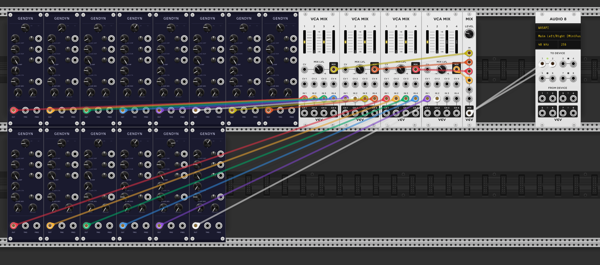

# GENDYN

A VCV Rack 2 implementation of Iannis Xenakis's dynamic stochastic synthesis algorithm (GENDY3, 1991).



> Xenakis's original: [GENDY3 on YouTube](https://www.youtube.com/watch?v=KM7MkHmBEXQ)

---

## Algorithm

GENDYN implements a piecewise-linear oscillator whose waveform shape evolves stochastically each cycle. Each of the N breakpoints has an amplitude and a duration (in samples) that follow a single-level random walk with reflecting barriers (Serra 1993, eq. 2):

```
y_{i,j+1} = y_{i,j} + f(z)
```

where `f(z)` is drawn from the chosen distribution and mirrored into `[−limit, +limit]` before being applied. The result is then mirrored back into the barrier range.

**Continuity condition** (Serra eq. 1): breakpoint 0 of each new cycle is pinned to the last value of the previous cycle, keeping the output seamless at every cycle boundary.

Frequency is emergent — it equals `sampleRate / sum(dur[i])` across all N breakpoints.

## Controls

| Control | Description |
|---------|-------------|
| N | Number of breakpoints (integer, 2–64) |
| SCALE AMP | Step scale for amplitude random walk (0–1) |
| SCALE DUR | Step scale for duration random walk (0–1) |
| B AMP | Amplitude barrier half-width (0=frozen, 1=full ±5V range) |
| B DUR CTR | Center frequency for duration barriers (20–5000 Hz) |
| B DUR WID | Duration barrier half-width around center (0=fixed pitch, 1=wide) |
| DIST | Distribution: 0=Cauchy, 1=Gaussian, 2=Uniform, 3=Logistic (default) |

## CV Inputs

All CV inputs are ±5V with attenuverter knobs (±5V × attenuverter × 0.1 = ±0.5 modulation depth).

| Input | Target |
|-------|--------|
| SCALE AMP CV | Amplitude step scale |
| SCALE DUR CV | Duration step scale |
| B AMP CV | Amplitude barrier |
| B DUR CV | Duration barrier width |

## Outputs

| Output | Description |
|--------|-------------|
| OUT | Audio output, ±5V |
| TRIG | 10V / 1ms trigger on each complete waveform cycle |
| FREQ | Current frequency as 1V/oct CV (0V = C4 = 261.626 Hz) |

## Tuning notes

- **SCALE AMP / SCALE DUR** control how quickly the waveform evolves. The correlation time is roughly `(1/scale)²` cycles. At 220 Hz with scale=0.02 that is ~2500 cycles ≈ 11 seconds.
- Higher-frequency voices update more often per second and will evolve faster than lower ones at the same scale setting. Tune voices individually or feed them different scale CV.
- **B DUR WID = 0** locks pitch to B DUR CTR; the stochastic walk then evolves timbre only. This is how Xenakis achieved the "beautiful clear tones" in the middle sections of GENDY3.
- Logistic distribution (DIST=3) is the closest match to Xenakis's original and is the default.

## Compositional technique

Xenakis composed GENDY3 by varying barrier widths per voice per section. Wide barriers allow chaotic drift; narrow barriers freeze or constrain the walk. In a multi-voice patch, slow modulation of B AMP and B DUR CV inputs shapes large-scale form.

See the `patches/` folder for reference patches:
- `GENDY3_2voice.vcv` — two slow low-register voices (60 Hz, 80 Hz)
- `GENDY3_16voice.vcv` — 16-voice spread across the spectrum with LFO barrier modulation
- `GENDY3_cluster.vcv` — Xenakis's actual 14-voice pitch cluster from the score (Hoffmann 2022, Table 1)

Patch files can be regenerated from the scripts in `tools/`:

```bash
python3 tools/make_patch_2voice.py
python3 tools/make_patch.py
python3 tools/make_patch_cluster.py
```

## Building

Download the [VCV Rack 2 Plugin SDK](https://vcvrack.com/downloads) and set `RACK_DIR` to the extracted path.

```bash
# Linux
make RACK_DIR=~/Rack2-SDK/Rack-SDK
make RACK_DIR=~/Rack2-SDK/Rack-SDK dist
cp dist/GENDYN-2.0.0-lin-x64.vcvplugin ~/.Rack2/plugins-lin-x64/

# Windows (cross-compile from Linux with MinGW)
RACK_DIR=~/Rack2-SDK-win/Rack-SDK \
CC=x86_64-w64-mingw32-gcc-posix \
CXX=x86_64-w64-mingw32-g++-posix \
MACHINE=x86_64-w64-mingw32 \
make dist
```

## References

- Serra, X. (1993). Musical Sound Modeling with Sinusoids plus Noise. In G. De Poli, A. Piccialli, & C. Roads (Eds.), *Musical Signal Processing*. Swets & Zeitlinger.
- Hoffmann, P. (2022). The Genesis of GENDY3. *Computer Music Journal*, 46(1).
- Xenakis, I. (1992). *Formalized Music*. Pendragon Press.
